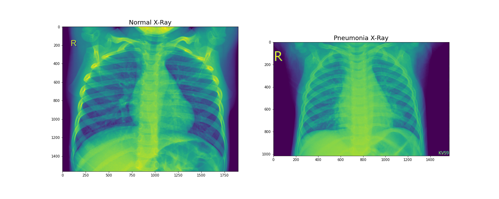
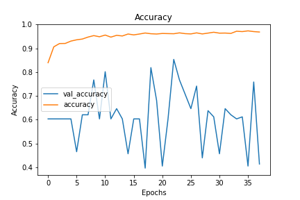
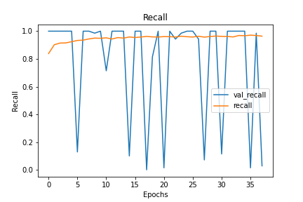
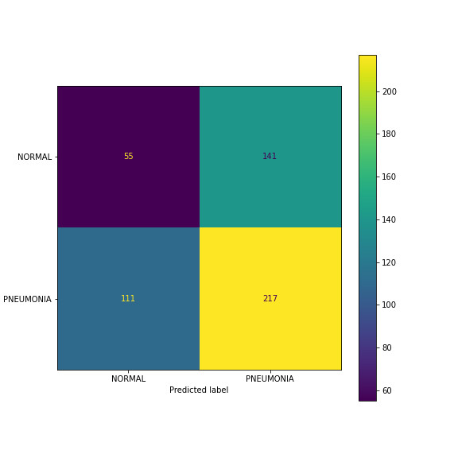

# Pneumonia X-ray Analysis

## This Repository

### Repository Directory

```
├── README.md        <-- Main README file explaining the project's business case,
│                        methodology, and findings
│
├── xrays.yml       <-- Environment to run notebook
│
├── chest_xray       <-- Data in jpeg format
│   ├── train        <-- Training data used for modeling
│   ├── new_val      <-- Validation data used for modeling
│   ├── new_test     <-- Test data used for modeling
│   ├── val          <-- Original validation data (only includes 16 images)
│   └── test         <-- Original test data (before moving 100 images to vaidation)
│
├── model            <-- Final model
│
├── notebooks        <-- Jupyter Notebooks for exploration and presentation
│   ├── exploratory  <-- Unpolished exploratory data analysis (EDA) notebooks
│   └── report       <-- Polished final notebook
│
├── reports          <-- Generated analysis (including presentation.pdf)
│   └── images       <-- Images used in reporting
│
└── src              <-- Relevant source code
```

### Quick Links
1. [Final Analysis Notebook](notebooks/report/complete_analysis.ipynb)
2. [Presentation Slides](reports/presentation.pdf)

### Setup Instructions

To create a replica of the environment needed to run my notebook, run: 

`conda env create --file xrays.yml`

## Data Understanding

### Visual Inspection

Below is an example comparing an x-ray of a normal patient (left) to the x-ray of a patient with pneumonia (right):


### Brightness Comparison

As shown below, the average brightness of the normal x-rays aligns with the average brightness of the pneunomia x-rays; however, the distribution of the brightness of the pneumonia x-rays is wider than the distribution of the brightness of the normal x-rays.


## Model Development

Initially I ran two very simple models: one baseline model with a single hidden layer, and one convolutional neural network with a single hidden layer.  To review the simple models, please review my [Simple Model notebook](notebooks/exploratory/simple_models.ipynb).

I then tried various classic algorithms on the data to determine which provided the best predictions on the data.  To review the analysis on the classic algorithms, please review my [Classic Architectures notebook](notebooks/exploratory/classic_architectures.ipynb).
  
I found that LeNet5 performed best on the data.  I therefore used LeNet5 as a basis for my models.  To review my modeling process, please review my [Build Models Notebook](notebooks/exploratory/build_models.ipynb).

### Final Model
- Started with LeNet5
- Replaced AveragePooling2D after convolutional layers with MaxPooling2D and BatchNormalization
- Dropped 50% of the input units before every dense layer
- Replaced ReLU activation functions with LeakyReLU

## Results

Validation loss improved after 4 epochs:\


Validation accuracy and recall did not perform very well:\
 


My model classified the test data with 54% accuracy and 65% recall:\


But as depicted in the [LIME](https://github.com/marcotcr/lime) images below where pros (evidence of pneumonia) are highlighted in green and cons (evidence of not pneumonia) are highlighted in red, my model did not focus on the proper areas of the lungs:\


The LIME heatmap confirms that the model focused on the wrong areas of the x-rays:\


## Conclusion
- I created a convolutional neural network model that classifies x-rays of patients with pneumonia.
- The model is not performing very well
    - The accuracy of the model is only at 54% with a recall of 65% 
    - The model is not classifying the images by focusing solely on the lungs
- Though the model is not performing very well, I have created the tools to monitor the performance of the model during training, and to determine what portions of the x-ray the model is focusing on to perform the classification

## Next Steps
- Continue adjusting model parameters to improve model classification
- Obtain input from radiologists to ensure model considers appropriate features
